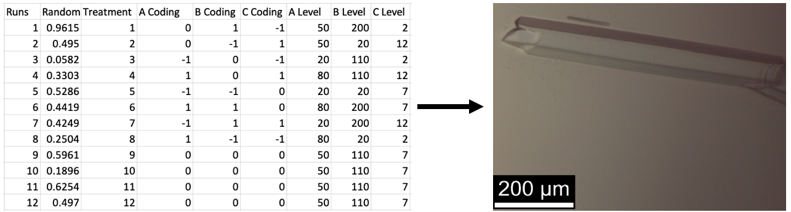
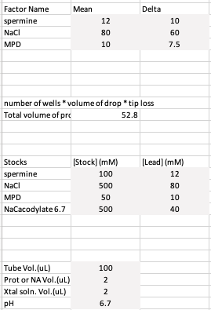
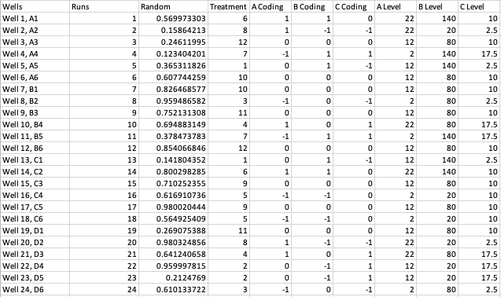
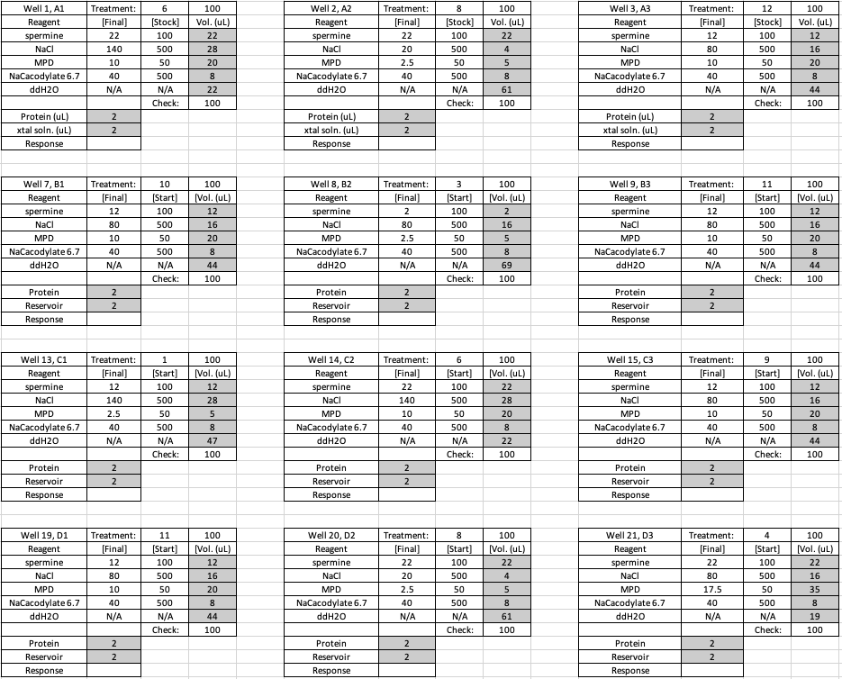
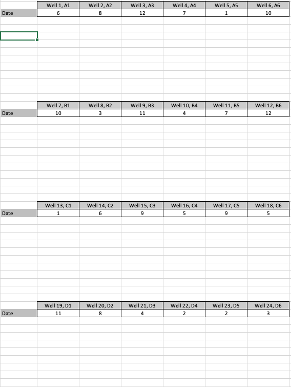
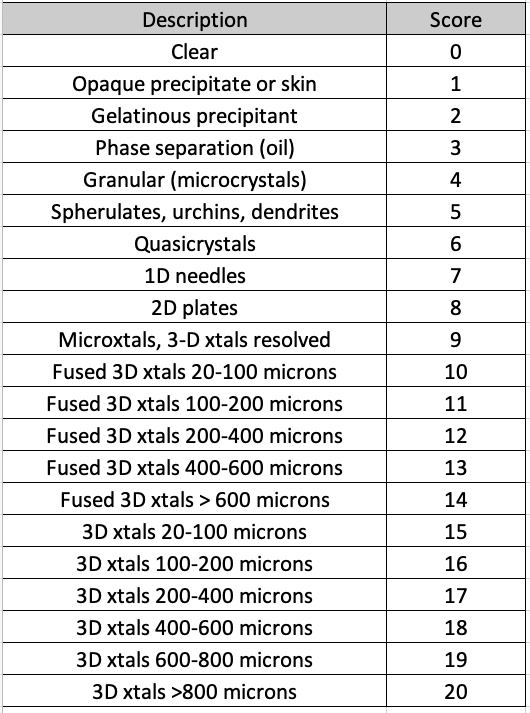

# dsd4xtals: Crystal improvement with Definitive Screening Designs (DSDs)

## Purpose
This repository contains Excel spreadsheets for applying Definitive Screening Designs (DSDs) to the size optimization of crystals of biological macromolecules (proteins and nucleic acids).
Bradley Jones and Christopher Nachtscheim developed DSDs ([Jones and Nachtscheim 2011](https://doi.org/10.1080/00224065.2011.11917841)).
Crystal size is generally proportional to its diffraction power, provided that the crystal is not internally disordered and that it was properly cryoprotected.
Crystallographers seek large crystals to obtain high-resolution data for high-quality structures.
It takes about 3 minutes to edit a spreadsheet to customize it for a new crystallization experiment.
These spreadsheets ease applying DSDs in laboratory experiments.
These spreadsheets could also be adapted to other laboratory and field experiments.
Please post an issue if you need a design with a run configuration that differs from a 4 x 6 array.

## Why DSDs?

DSDs are efficient designs for identifying the critical experimental factors that influence crystal size and for identifying other factors that have no or little influence.
These designs are orthogonal and can detect the main effects and quadratic effects. 
These designs cannot detect higher-order interactions. 
DSDs are part of a class of experimental screening designs, including the widely known fractional factorial designs.
Despite their name, these screening designs are generally too small to adequately sample crystallization space.
Instead, we foresee DSDs being used after crystal leads have been found by using sparse matrix crystallization screens or prior knowledge of the crystallization of closely related proteins.
The reduction in the number of factors to the vital few makes more efficient use of material and time during subsequent experiments that optimize the levels of each vital factor to find the combination of factor levels that lead to the largest crystals.

## Contents of design library

This first set of designs is limited to testing three to 11 factors.
These designs can fit in a 24-well crystallization tray format.
We plan to make designs for a 96-well format for use with liquid handling robots and crystallization robots.
Robots have the advantage of reduced experimental error due to more precise liquid handling.

There is one spreadsheet per design.
The user enters the factors' names, their central factor level, and the delta to set the low and high levels to be tested.
The user also enters the stock concentrations for chemical components; the spreadsheet autogenerates the volumes of each stock solution and of water to be added to the crystallization solution.

A specific combination of factor levels are assigned to a particular crystallization well (an experimental `run' or `treatment' ) through the design matrix.
The design matrix is represented by the columns of codings (see below).
These codings have values of -1, 0, and +1 for continuous variables and -1 and 1 for categorical variables.
It is best to minimize the number of categorical variables because their presence complicates the analysis and weakens the power of the experiment. 

The assignment of the runs to the wells (see below) should be randomized upon each new use of the experimental design. 
Instructions are included in the spreadsheet on randomizing the runs' assignment to the wells.
There is a column of random numbers that are used to randomize the assignment of treatments to wells.
After the rows are sorted based on the random numbers, a new set of random numbers is automatically generated and ready for use in another round of randomization.

The results response that we seek to maximize is crystal size.
In my lab, we use the most extended length of the longest crystal.
This crystal is the one that is most apt to be cryo-protected successfully.
We record this information in a scoresheet (see below) by date.

Alternatively, a 21-level scoring system can be used.
An example is shown below and is included in the spreadsheets.

The spreadsheets are named according to the following key: 

- DSD code for the experimental design type
- r  number of runs
- C number of chemical factors
- P number of physical factors
- c number of categorical factors

To download the spreadsheets, git clone the repo or click on `code` in the green button in the upper right and select `Download zip` to download all of the files. Downloading a single Excel file is problematic. 

## Analysis of the results

Because the continuous factors have three levels, non-linear effects can approximated with linear models that contain quadratic terms. 
These linear models can be applied using the response surface methodology.
These analysis tools are available through the R package `rsm` by Lenth (2009).

## Sources of funding

- NIH: R01 CA242845, R01 AI088011; P30 CA225520 (PI: R. Mannel); P20GM103640 and P30GM145423 (PI: A. West)
- OCAST HR20-002
- PHF Team Science Grant 

## References
Jones, B. and Nachtsheim, C. J. (2011) A Class of Three-Level Designs for Definitive Screening in the Presence of Second-Order Effects. Journal of Quality Technology, 43, 1-15.

Lenth, R.V. (2009) Response-Surface Methods in R, using rsm. Journal of Statistical Software, 32, 1–17.

